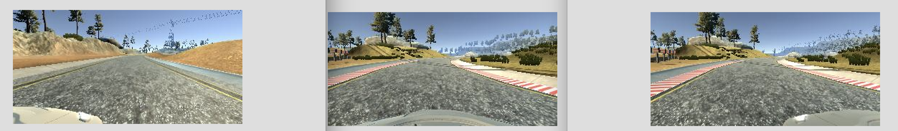

# **Behavioral Cloning** 

---

**Behavioral Cloning Project**

The goals / steps of this project are the following:
* Use the simulator to collect data of good driving behavior
* Build, a convolution neural network in Keras that predicts steering angles from images
* Train and validate the model with a training and validation set
* Test that the model successfully drives around track one without leaving the road
* Summarize the results with a written report

--- 

#### 1. Submission includes all required files and can be used to run the simulator in autonomous mode

My project includes the following files:
* behavior_clone.py : containing the script to create and train the model
* drive.py : for driving the car in autonomous mode
* model-modeified-LeNet-Crop-Flip.h5 : containing a trained convolution neural network 
* README.md : summarizing the results
* autonomous-driving-track1.mp4 : autonomous driving video clip of track1
* autonomous-driving-track2.mp4 : autonomous driving video clip of track2
  (the model drove track 2 quite well, except that it often stuck at a track where it had drastic corner with shadow.)

#### 2. Submission includes functional code
Using the Udacity provided simulator and my drive.py file, the car can be driven autonomously around the track by executing 

```sh
python drive.py model-modeified-LeNet-Crop-Flip.h5
```

#### 3. Submission code is usable and readable

The behavior_clone.py file contains the code for training and saving the convolution neural network. The file shows the pipeline I used for training and validating the model.


### Model Architecture and Training Strategy

#### 1. An appropriate model architecture has been employed

Following shows the applied model architecture. The model is extended from LeNet.
It gets 160 x 320 RGB image as an input and normalized by a Lambda function. In the next layer, the image is cropped and using '''tensorflow.image.rgb_to_grayscale(x)''' function 
Applied 5 x 5 convolution with 6 filters, valid padding and relu activation. Then applied maxpooling of stride 1x1.
This structure is repeated 4 times to get deeper network structure and feature map. 
After flattening applied drop out of 0.1 rate before fully connected layer. Applied 3 fully connected layers.


```
____________________________________________________________________________________________________
Layer (type)                     Output Shape          Param #     Connected to                     
====================================================================================================
lambda_1 (Lambda)                (None, 160, 320, 3)   0           lambda_input_1[0][0]             
____________________________________________________________________________________________________
cropping2d_1 (Cropping2D)        (None, 100, 320, 3)   0           lambda_1[0][0]                   
____________________________________________________________________________________________________
lambda_2 (Lambda)                (None, 100, 320, 1)   0           cropping2d_1[0][0]               
____________________________________________________________________________________________________
convolution2d_1 (Convolution2D)  (None, 96, 316, 6)    156         lambda_2[0][0]                   
____________________________________________________________________________________________________
maxpooling2d_1 (MaxPooling2D)    (None, 48, 158, 6)    0           convolution2d_1[0][0]            
____________________________________________________________________________________________________
convolution2d_2 (Convolution2D)  (None, 44, 154, 6)    906         maxpooling2d_1[0][0]             
____________________________________________________________________________________________________
maxpooling2d_2 (MaxPooling2D)    (None, 22, 77, 6)     0           convolution2d_2[0][0]            
____________________________________________________________________________________________________
convolution2d_3 (Convolution2D)  (None, 18, 73, 6)     906         maxpooling2d_2[0][0]             
____________________________________________________________________________________________________
maxpooling2d_3 (MaxPooling2D)    (None, 9, 36, 6)      0           convolution2d_3[0][0]            
____________________________________________________________________________________________________
convolution2d_4 (Convolution2D)  (None, 5, 32, 6)      906         maxpooling2d_3[0][0]             
____________________________________________________________________________________________________
maxpooling2d_4 (MaxPooling2D)    (None, 2, 16, 6)      0           convolution2d_4[0][0]            
____________________________________________________________________________________________________
flatten_1 (Flatten)              (None, 192)           0           maxpooling2d_4[0][0]             
____________________________________________________________________________________________________
dropout_1 (Dropout)              (None, 192)           0           flatten_1[0][0]                  
____________________________________________________________________________________________________
dense_1 (Dense)                  (None, 120)           23160       dropout_1[0][0]                  
____________________________________________________________________________________________________
dropout_2 (Dropout)              (None, 120)           0           dense_1[0][0]                    
____________________________________________________________________________________________________
dense_2 (Dense)                  (None, 84)            10164       dropout_2[0][0]                  
____________________________________________________________________________________________________
dense_3 (Dense)                  (None, 1)             85          dense_2[0][0]                    
====================================================================================================
Total params: 36,283
Trainable params: 36,283
Non-trainable params: 0
____________________________________________________________________________________________________

```

Following is the corresponding keras code snippet.

```python
model = Sequential()
model.add(Lambda(lambda x : (x/255.) - 0.5,input_shape=(160,320,3)))
model.add(Cropping2D(cropping=((40,20),(0,0))))
model.add(Lambda(gray_conversion))
model.add(Convolution2D(6,5,5, border_mode="valid", activation='relu'))
model.add(MaxPooling2D())
model.add(Convolution2D(6,5,5, border_mode="valid", activation='relu'))
model.add(MaxPooling2D())
model.add(Convolution2D(6,5,5, border_mode="valid", activation='relu'))
model.add(MaxPooling2D())
model.add(Convolution2D(6,5,5, border_mode="valid", activation='relu'))
model.add(MaxPooling2D())
model.add(Flatten())
model.add(Dropout(0.4))
model.add(Dense(120))
model.add(Dropout(0.2))
model.add(Dense(84))
model.add(Dense(1))
model.summary()
```


#### 2. Attempts to reduce overfitting in the model

The model applied maxpooling and dropout layers in order to reduce overfitting.
More importantly, I have collected lots of training data for better generalization.
The training data was collected both from track1 and track2.
The data contains also enough track recovery and corner cases.
The model was trained and validated on different data sets to ensure that the model was not overfitting.
The model was tested by running it through the simulator and ensuring that the vehicle could stay on the track.


#### 3. Model parameter tuning

The model used an adam optimizer, so the learning rate was not tuned manually.

#### 4. Appropriate training data

Training data was chosen to keep the vehicle driving on the road. I used a combination of 

- center lane driving, 
- counter clock driving,
- recovering from the left,
- recovering from right sides,
- smooth cornering.. 


### Model Architecture and Training Strategy

#### 1. Solution Design Approach

The overall strategy for deriving a model architecture was to extend the simple model used in the lecture. 

My first step was to use a convolution neural network model similar to the LeNet.

After testing the first model, it showed lots of flaws on the corner, it tend to get out of the track.

Therefore, more data was collected by recording lots of recovering scenes from left and right sides.

Applying cropping and grayscaling also helped improving accuracy of the model. 

The driving was not smooth as expected, therefore augmented the dataset by flipping frames of center camera, left and right camera.

Applying deeper convolutional layer also helped. 

At the end of the process, the vehicle is able to drive autonomously around the track without leaving the road.


#### 2. Final Model Architecture

```
____________________________________________________________________________________________________
Layer (type)                     Output Shape          Param #     Connected to                     
====================================================================================================
lambda_1 (Lambda)                (None, 160, 320, 3)   0           lambda_input_1[0][0]             
____________________________________________________________________________________________________
cropping2d_1 (Cropping2D)        (None, 100, 320, 3)   0           lambda_1[0][0]                   
____________________________________________________________________________________________________
lambda_2 (Lambda)                (None, 100, 320, 1)   0           cropping2d_1[0][0]               
____________________________________________________________________________________________________
convolution2d_1 (Convolution2D)  (None, 96, 316, 6)    156         lambda_2[0][0]                   
____________________________________________________________________________________________________
maxpooling2d_1 (MaxPooling2D)    (None, 48, 158, 6)    0           convolution2d_1[0][0]            
____________________________________________________________________________________________________
convolution2d_2 (Convolution2D)  (None, 44, 154, 6)    906         maxpooling2d_1[0][0]             
____________________________________________________________________________________________________
maxpooling2d_2 (MaxPooling2D)    (None, 22, 77, 6)     0           convolution2d_2[0][0]            
____________________________________________________________________________________________________
convolution2d_3 (Convolution2D)  (None, 18, 73, 6)     906         maxpooling2d_2[0][0]             
____________________________________________________________________________________________________
maxpooling2d_3 (MaxPooling2D)    (None, 9, 36, 6)      0           convolution2d_3[0][0]            
____________________________________________________________________________________________________
convolution2d_4 (Convolution2D)  (None, 5, 32, 6)      906         maxpooling2d_3[0][0]             
____________________________________________________________________________________________________
maxpooling2d_4 (MaxPooling2D)    (None, 2, 16, 6)      0           convolution2d_4[0][0]            
____________________________________________________________________________________________________
flatten_1 (Flatten)              (None, 192)           0           maxpooling2d_4[0][0]             
____________________________________________________________________________________________________
dropout_1 (Dropout)              (None, 192)           0           flatten_1[0][0]                  
____________________________________________________________________________________________________
dense_1 (Dense)                  (None, 120)           23160       dropout_1[0][0]                  
____________________________________________________________________________________________________
dropout_2 (Dropout)              (None, 120)           0           dense_1[0][0]                    
____________________________________________________________________________________________________
dense_2 (Dense)                  (None, 84)            10164       dropout_2[0][0]                  
____________________________________________________________________________________________________
dense_3 (Dense)                  (None, 1)             85          dense_2[0][0]                    
====================================================================================================
Total params: 36,283
Trainable params: 36,283
Non-trainable params: 0
____________________________________________________________________________________________________

```


#### 3. Creation of the Training Set & Training Process

Volume of collected dataset 


To cope with inbalnce of the data volume merged dataset as shown below.


Used left - center - right images all together.




The key to avoid overfitting and generalization was to augment data by flipping every frame. 
this way 6 image frames are acquired ( left center right, left-flip, center-flip, right-flip )


```python
        # center,left,right,steering,throttle,brake,speed
        center_image = load_image(get_current_path(line[0]))
        center_angle = float(line[3])
        images.append(center_image)
        angles.append(center_angle)
        
        ## Augment dataset by adding flipped image and its measurement
        ## Center & flipped
        center_image_flipped = np.fliplr(center_image)    
        center_angle_flipped = center_angle*(-1)
        images.append(center_image_flipped)
        angles.append(center_angle_flipped)
        
        ## Left & flipped
        left_image = load_image(get_current_path(line[1]))
        left_angle = center_angle + cam_delta_left
        images.append(left_image)
        angles.append(left_angle)        
        
        left_image_flipped = np.fliplr(left_image)    
        left_angle_flipped = left_angle*(-1)
        images.append(left_image_flipped)
        angles.append(left_angle_flipped)

        ## Right & flipped
        right_image = load_image(get_current_path(line[2]))
        right_angle = center_angle - cam_delta_right
        images.append(right_image)
        angles.append(right_angle)

        right_image_flipped = np.fliplr(right_image)    
        right_angle_flipped = right_angle*(-1)
        images.append(right_image_flipped)
        angles.append(right_angle_flipped)
```


The augmented data, if all are loaded became in total around 110 GB 


* generator was also implemented and can be used. (code line 182 )

```python
model.fit_generator(train_generator, \
            samples_per_epoch=len(train_samples), \
            validation_data=validation_generator, \
            nb_val_samples=len(validation_samples), nb_epoch=nb_epoch)
```


Applied 5 epoch in total, mean square error was slightly going down.
In this model, the mean square error looks a bit bigger than the numbers we used to see in the lecture, because of the big data volume.

```bash
382945/382945 [==============================] - 539s - loss: 0.1290 - val_loss: 0.1144
Epoch 2/5
382945/382945 [==============================] - 627s - loss: 0.1164 - val_loss: 0.1105
Epoch 3/5
382945/382945 [==============================] - 629s - loss: 0.1139 - val_loss: 0.1130
Epoch 4/5
382945/382945 [==============================] - 625s - loss: 0.1126 - val_loss: 0.1071
Epoch 5/5
382945/382945 [==============================] - 623s - loss: 0.1115 - val_loss: 0.1064
```

Although the model worked very well, its size is quite small as, I've applied grayscale image in the second layer. 

```
470K model-modeified-LeNet-Crop-Flip.h5
```

### Usage 

```python
$ python drive.py model-modeified-LeNet-Crop-Flip.h5 autonomous-driving-track1 
```

```python
$ python drive.py model-modeified-LeNet-Crop-Flip.h5 autonomous-driving-track2
```

```python
$ python video.py autonomous-driving-track1 --fps 60
```

```python
$ python video.py autonomous-driving-track2 --fps 60
```

